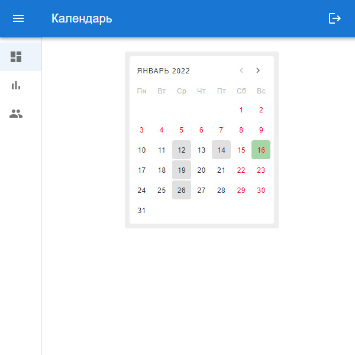
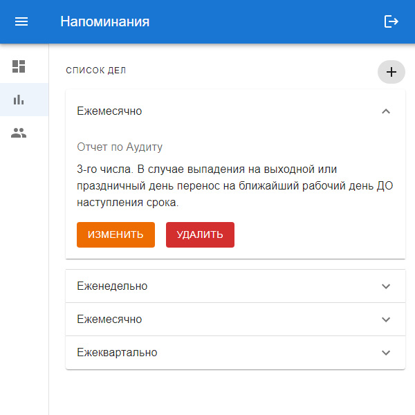
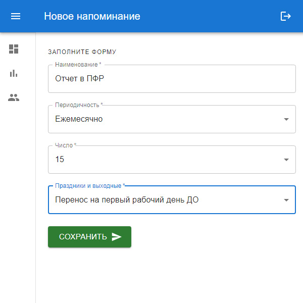
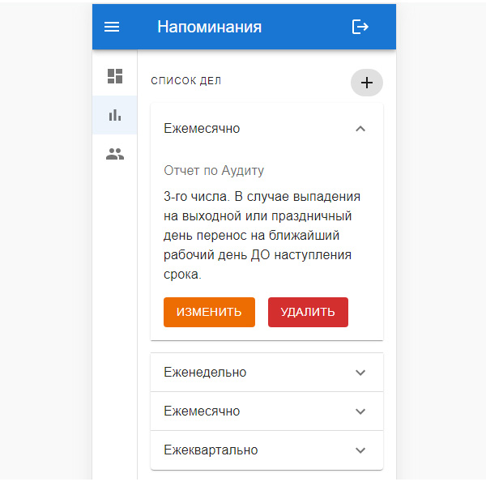
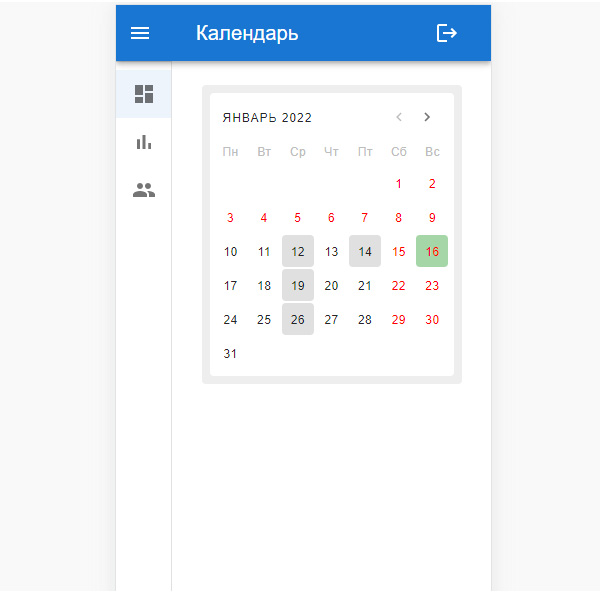
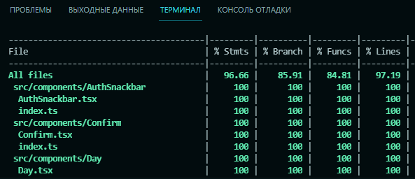
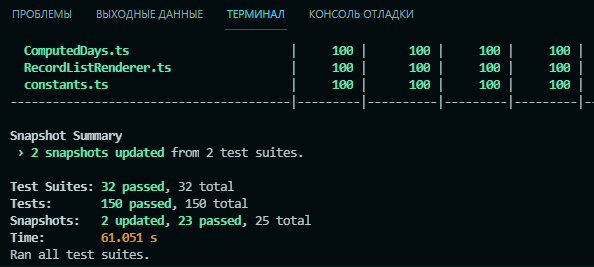

# Reminder

Продвинутые напоминания

## Стэк

**Frontend**: React + TypeScript + Material-UI

**Backend**: Firebase

## Как запускать?

1. `npm i` - установка необходимых пакетов
2. `npm run dev` - запуск в режиме разработки

**Для успешного запуска требуется файл переменных окружения `.env`**

Шаблон файла: `/.env.example` (настройки Firebase).

Приложение работает на порту 3000.

## Принтскрины

<kbd></kbd>

<kbd></kbd>

<kbd></kbd>

<kbd></kbd>

<kbd></kbd>

## Описание проекта

Reminder представляет собой программу для сохранения напоминаний. Важная особенность приложения заключается в том, что при настройке периодичности уведомлений можно учесть праздники и выходные. При желании, дата напоминания может быть перенесена на ближайший рабочий день до или после срока наступления события. Есть также и 3-й вариант – "Праздники и выходные не влияют". Доступно три основных режима настройки напоминания: "еженедельно", "ежемесячно", "ежеквартально".

В личном кабинете 3 раздела:

1. Календарь рабочих дел
2. Напоминания
3. Профиль

### Инициализация проекта

Приложение настроено без использования "Create React App". WebPack, tsconfig, jest.config, eslint, prettier настроены "с нуля" вручную.

### React и TypeScript

Приложение написано на функциональных компонентах React, на TypeScript. Работает с применением React Router, Redux, фреймворка Material-UI на "фронтенде". Входная точка – модуль "Авторизация/Регистрация". В качестве middleware для обработки асинхронных запросов подключен "redux-thunk".

В качестве "бэкенда" выступает Firebase (Authentication, Realtime Database).

### Unit-тестирование

Посредством Jest и Enzyme протестированы все компоненты, модули, редьюсеры, утилиты. Написано 150 тестов. Подключена библиотека husky для автозапуска тестирования перед записью нового коммита.

<kbd></kbd>

<kbd></kbd>